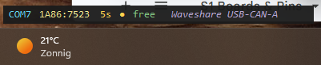
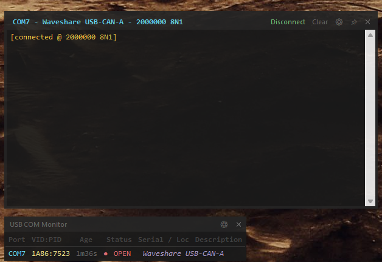

# USB COM Monitor

Small always-on-top desktop widget that lists every connected COM port at a glance — port name, VID/PID, how long it has been plugged in, whether it is open or free, plus a flash animation as ports come and go. Double-clicking a port opens a built-in serial terminal for it.

Useful during embedded development when you want to watch ports enumerate and talk to them without keeping Device Manager and a separate terminal program open.

## Features

- **Live port list** — port name, VID:PID, age, a colour status dot (green = free, red = open by another process, yellow = just appeared), open/free status, serial number / hub location, and the Windows description.
- **Flash on connect** — a newly appeared port flashes amber and fades back over the highlight duration; ports present at startup don't flash.
- **Removed ports linger** — unplugged ports stay listed in red and fade out for a configurable time so you can see what just disappeared.
- **Custom names** — give any device a memorable label, keyed by VID:PID:serial so it sticks across re-plugs.
- **Stays out of the way** — always-on-top (optionally dropped after idle), optional move-to-back on idle, and an opacity fade when you're not interacting with it. Transparency is adjustable.
- **Per-device memory** — names, serial settings, and terminal window size/position are saved per device in `settings.json`.

### Using it

- **Open a terminal** — click a row's **Status** cell. If the port is busy or the device is unplugged, the row shows *waiting* and the terminal opens automatically as soon as the port is free again.
- **Edit a custom name** — double-click the **Serial / Loc** cell, type a name, and press **Enter** (**Esc** cancels). Clear the text to remove the name.
- **Edit settings** — click the **⚙** button in the title bar. The dialog covers highlight duration, how long removed ports stay, always-on-top and its idle drop, move-to-back on idle, the fade-after-idle delay (0 = fade immediately on leaving), and live-preview sliders for window and terminal transparency.

## Terminal

A serial terminal opens in its own borderless window per device. Each remembers its own size and position.

- **Send / receive** — RX and TX are colour-coded in the output pane; type in the input line and press **Enter** to send, with a configurable line ending.
- **Smart auto-scroll** — follows new data only when you're already at the bottom, so scrolling up to read holds your position.
- **Connect / Disconnect** — toggle the connection from the title bar; the row's status reflects the live connection state.
- **Reconnect on unplug** — optionally keeps the terminal open when the device is removed and reconnects automatically when it returns.
- **Pin (📌)** — toggle the terminal's always-on-top independently of the main window.
- **Clear** the output, or open the **⚙** port settings.
- **Resizable** from any edge or corner; drag the title bar to move.

### Port settings

Open the terminal's **⚙** to set **baud, data bits, parity, stop bits, line ending,** and **reconnect-on-unplug**. Settings are saved per device (VID:PID:serial) and applied immediately on save.
